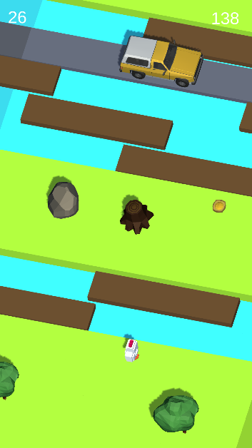

# Crossy road clone #

Here you can find a copy of the mobile game Crossy Road. 
More detailed information about the implementation can be found below.

### Features of implementation ###

* There are 3 states in the game.
	1. Start screen application
	2. Game Level Screen
	3. Screen the result of passing the level.
* Ability to collect coins
* A coin counter has been implemented.
	The number of coins is kept between sessions.
* On the game level screen and the result screen there is a track counter.
* On the result screen has been implemented.
	The record counter. The record is kept between sessions.
* The game has implemented the basic sounds.
* There is an on/off button on the result screen. State
	the sound settings are saved between sessions.
* `DoTween` is used to move objects on the level.
* To create and delete objects the `Objects pool` has been implemented.
* The scene where the game starts is called Main.
* Assets for characters and surrounding objects taken from the Asset Store.
* Unity version: `2019.3.5f`.

